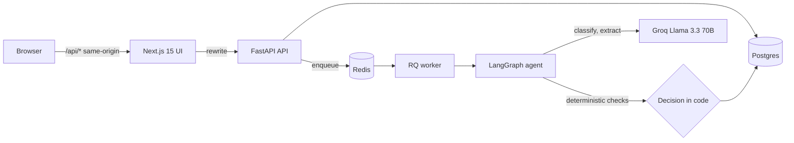

# VendorGuard

AI-assisted vendor document compliance review, built to be **safe to automate**: the model reads documents,
but plain code makes every decision, and a human can always override with a logged reason.

> **Live demo:** _add your Vercel URL here_ · One-click demo logins on the sign-in page (fabricated data only).


## What it does

| Role | Can do |
|------|--------|
| **Vendor** | Drag-and-drop a PDF, scan, image (PNG/JPG) or TXT, watch it move through Uploaded → Classified → Audited → Decision, see the outcome |
| **Admin** | See stat cards, filter/search the queue, open a detail drawer (document preview, AI reasoning, automated checks, security flags, audit runs), override a decision with a required reason, export the audit log as CSV, see which files were read with OCR and which security alerts fired |

## v1.1 additions

- **OCR fallback.** Scanned PDFs and PNG/JPG uploads are read with Tesseract when digital text extraction yields under 50
  characters. OCR text is treated as untrusted, and OCR'd documents need a higher confidence (0.92 vs 0.85) to be auto-approved.
- **Security alerts.** Suspected prompt injection (and unverifiable Tax IDs) post a signed alert to Slack, Teams, or any
  webhook. Alerts contain no document text, are throttled per vendor, and are logged in the database.

## Architecture



The agent is a 3-node LangGraph: **classify → evaluate → finalize**. The model only *extracts facts*; `finalize`
decides. A submission is auto-approved only if every check passes, nothing is flagged, and confidence ≥ 0.85.
Anything unusual goes to a person. Errors never approve.

## Security model (and the test that proves each claim)

| Threat | Defence | Test |
|--------|---------|------|
| Prompt injection inside a vendor document | Untrusted-data system prompt, random-nonce delimiters, invisible-character stripping, regex tripwire, model self-report. Any flag blocks approval | `test_injection_text_blocks_approval_even_if_model_says_yes` |
| Model hijacked or hallucinating | Model never decides; Tax ID must literally appear in the document text | `test_hijacked_model_with_fabricated_tax_id_is_not_approved` |
| LLM outage / bad output | Fail closed to human review; no raw error text in results | `test_llm_outage_fails_closed` |
| Attacker tunes payloads from feedback | Vendors see only the outcome, never flags, checks or reasoning | `test_upload_is_processed_and_vendor_view_hides_internals` |
| IDOR (reading another vendor's files) | Ownership check on every route, 404 for others | `test_vendor_cannot_read_another_vendors_submission` |
| Privilege escalation | Role read from the DB each request; register can never create admins | `test_register_cannot_choose_admin_role` |
| Session theft via XSS | JWT in an httpOnly, SameSite=Lax cookie (never in JS-readable storage) | verified by hand in the smoke test (HttpOnly flag) |
| CSRF | Custom required header + SameSite cookies + no CORS | `test_csrf_header_required` |
| Malicious upload | Type decided by content sniffing, random stored filename, 10 MB cap | `test_fake_pdf_and_binary_files_are_rejected` |
| Credential stuffing / user enumeration | Rate limits, argon2id, constant-time unknown-user path, generic errors | `test_login_errors_are_generic` |
| Hidden text in scanned images used for injection | OCR output goes through the same injection scan, plus a stricter approval threshold | `test_ocr_text_needs_higher_confidence_to_auto_approve` |
| Image bombs / malformed images | Content sniffing (PNG/JPEG only, no SVG/GIF), 40-megapixel cap, page cap, per-page timeout, OCR failure = human review | `test_oversized_image_is_refused`, `test_unsupported_image_types_are_rejected` |
| Chat-message injection through a vendor-controlled title (`<!channel>`, links) | Titles are stripped and escaped before they reach Slack/Teams | `test_slack_message_cannot_be_used_for_mention_or_link_injection` |
| Alert flooding of the SOC channel | Per-vendor hourly cap, suppressed alerts still logged | `test_per_vendor_hourly_cap_stops_alert_flooding` |
| SSRF through the webhook URL | URL from environment only, https required, private/loopback/metadata addresses blocked, no redirects | `test_ssrf_targets_are_blocked` |
| Webhook secret leaking into logs or the database | Only the status code (for example "HTTP 404") is stored | `test_failed_delivery_is_recorded_without_leaking_the_secret_url` |
| CSV formula injection in the audit export | Cells starting with `= + - @` are neutralised | `test_csv_export_neutralises_formula_injection` |

**Known limits.** Prompt-level defences reduce risk but cannot eliminate it, which is why approval needs deterministic
checks and humans stay in the loop. The regex tripwire is easy to evade with paraphrasing. Rate limiting is per IP.
Local file storage should become S3 with pre-signed URLs for production. OCR runs locally (Tesseract) but is slower and less accurate than a commercial OCR service on poor scans. Alert delivery is best-effort with one retry. Vendor documents are sent to a third-party LLM
API, so check data-handling requirements before using real client data.

## Run it

```bash
cp .env.example .env        # fill in SECRET_KEY and POSTGRES_PASSWORD (GROQ_API_KEY optional)
docker compose up --build
docker compose exec backend python -m app.seed   # fake demo data
# open http://localhost:3000
```

Without Docker: see `WALKTHROUGH.md` (SQLite, in-process queue, two terminals).

## Tests

```bash
cd backend && sudo apt install -y tesseract-ocr && pip install -r requirements.txt && pytest -q   # 58 tests, no API key; OCR tests need Tesseract (skipped if absent)
```

CI (`.github/workflows/ci.yml`) runs the backend suite and a frontend build + typecheck on every push.

## Layout

```
backend/   FastAPI, SQLAlchemy, RQ worker, LangGraph agent (app/agents/compliance_agent.py), tests
frontend/  Next.js 15 (App Router), Tailwind, light/dark theme, hand-rolled accessible components
```

## Roadmap

S3 storage with pre-signed URLs · vendor remediation loop · policy RAG · email notifications · SSO · Alembic migrations ·
per-vendor analytics · evaluation set to track model accuracy over time.

_Built by [Chidama Tech Partners](#)._
